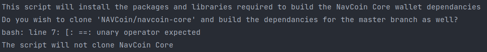

When building navcoin-code on my machine (Ubuntu 18.04), I've had the following problem:

Ubuntu
18.04 [build script](https://github.com/navcoin/navcoin-dev-tools/blob/master/ubuntu-18.04-navcoin-core-dev-setup.sh)
asks for user input:

```
read -p 'Enter Y for yes or anything else to decline: ' uservar

if [ $uservar == "Y" ]
then
    echo "The script will clone NavCoin Core and attempt to build the depends"
else
    echo "The script will not clone NavCoin Core"
fi
```

Problem:

when running with curl in the following way

`curl script_url | bash`

the user input is not taken (I am not sure why).
this results in an error:


the following alternative
[from this answer](https://unix.stackexchange.com/questions/339237/whats-the-difference-between-curl-sh-and-sh-c-curl)
does not have such a problem:

`bash "$(curl script_url)"`

also good to note that, while investigating the issue, I've come
across [this article](https://0x46.net/thoughts/2019/04/27/piping-curl-to-shell/) which has good arguments against
such usage of curl and pipes, but unfortunately does not point to an alternative.

disclaimer:

1. my current machine has a lot of quirks, so I am not sure if it is a general problem.
   I've used `curl https://raw.githubusercontent.com/mdacach/navcoin-core/master/bash_curl_input_test.sh | bash` as a
   test
2. even though the error is displayed, the script still ran fine with the downloads, it just didn't use the user input.
